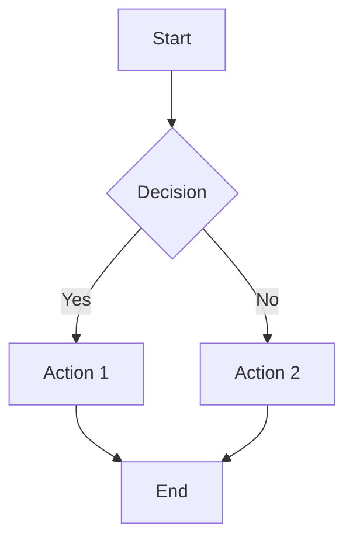
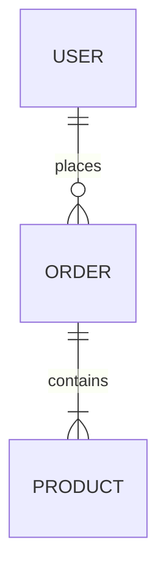

# Diagram Service API Reference

**Version**: 3.0.0
**Base URL**: `http://localhost:8080` (local) | Production via Railway
**Last Updated**: December 2024

---

## Overview

The Diagram Service (v3.0) provides comprehensive diagram generation using SVG, Mermaid, and Python charts.

| Category | Endpoints | Types | Purpose |
|----------|-----------|-------|---------|
| **Director Coordination** | 3 | - | Service discovery, routing |
| **Core Generation** | 4 | 38 | Diagram generation + polling |
| **Layout Service** | 4 | 11 | Layout Service integration |

**Generation Capabilities**:
- **Mermaid Types**: 7 (flowchart, erDiagram, journey, gantt, quadrantChart, timeline, kanban)
- **SVG Templates**: 25 (cycles, pyramids, funnels, matrices, timelines, etc.)
- **Python Charts**: 6 (pie, bar, line, scatter, network, sankey)
- **Total**: 38 diagram types

---

# PART 1: DIRECTOR COORDINATION ENDPOINTS

The Director coordination endpoints follow `SERVICE_CAPABILITIES_SPEC.md` for Strawman integration.

---

## 1.1 GET /capabilities

**Purpose**: Service discovery - what can this service do?

### Response Schema

```json
{
  "service": "diagram-service",
  "version": "3.0.0",
  "status": "healthy",
  "capabilities": {
    "slide_types": ["diagram", "flowchart", "architecture"],
    "diagram_types": [
      "flowchart", "erDiagram", "journey", "gantt",
      "quadrantChart", "timeline", "kanban"
    ],
    "supports_themes": true,
    "mermaid_output": true
  },
  "content_signals": {
    "handles_well": [
      "processes", "workflows", "decision_trees", "system_architecture",
      "relationships", "sequences", "timelines", "project_schedules",
      "user_journeys", "data_models", "task_boards"
    ],
    "handles_poorly": [
      "pure_data", "bullet_lists", "comparisons_without_flow",
      "numerical_charts", "pie_charts", "bar_graphs", "scatter_plots"
    ],
    "keywords": [
      "flow", "process", "workflow", "architecture", "components",
      "sequence", "interaction", "diagram", "entity", "relationship",
      "timeline", "gantt", "schedule", "journey", "kanban", "board",
      "steps", "decision", "database", "schema"
    ]
  },
  "diagram_type_signals": {
    "flowchart": {
      "best_for": ["process", "workflow", "decision tree", "steps"],
      "keywords": ["flow", "process", "steps", "if/then", "decision", "workflow", "procedure", "algorithm"]
    },
    "erDiagram": {
      "best_for": ["data models", "relationships", "database schema", "entities"],
      "keywords": ["entity", "relationship", "database", "model", "schema", "table", "foreign key", "primary key"]
    },
    "journey": {
      "best_for": ["user journey", "customer experience", "satisfaction"],
      "keywords": ["journey", "experience", "user", "customer", "satisfaction", "touchpoint", "persona"]
    },
    "gantt": {
      "best_for": ["project timeline", "scheduling", "milestones"],
      "keywords": ["timeline", "project", "schedule", "gantt", "milestones", "deadline", "phase", "task", "duration"]
    },
    "quadrantChart": {
      "best_for": ["priority matrix", "risk assessment", "positioning"],
      "keywords": ["quadrant", "matrix", "priority", "risk", "assessment", "high/low", "impact", "effort"]
    },
    "timeline": {
      "best_for": ["historical events", "milestones", "chronology"],
      "keywords": ["timeline", "history", "events", "milestones", "year", "date", "chronological"]
    },
    "kanban": {
      "best_for": ["task management", "workflow status", "board"],
      "keywords": ["kanban", "board", "tasks", "todo", "progress", "status", "backlog", "doing", "done"]
    }
  },
  "endpoints": {
    "capabilities": "GET /capabilities",
    "generate": "POST /generate",
    "can_handle": "POST /can-handle",
    "recommend_diagram": "POST /recommend-diagram",
    "status": "GET /status/{job_id}"
  }
}
```

---

## 1.2 POST /can-handle

**Purpose**: Content negotiation - can service handle this content?

### Request Schema

```json
{
  "slide_content": {
    "title": "User Registration Flow",           // Required: slide title
    "topics": [                                  // Required: topic bullets
      "User enters email",
      "System validates input",
      "Send confirmation email",
      "User clicks activation link"
    ],
    "topic_count": 4                             // Required: number of topics
  },
  "content_hints": {                             // Optional: pre-analyzed hints
    "has_numbers": false,                        // Contains numerical data
    "is_comparison": false,                      // Is comparison content
    "is_time_based": false,                      // Has temporal elements
    "detected_keywords": ["flow", "user", "system"]  // Keywords detected by Director
  },
  "available_space": {                           // Optional: layout constraints
    "width": 1800,                               // Available width in pixels
    "height": 750,                               // Available height in pixels
    "layout_id": "L25"                           // Layout identifier
  }
}
```

### Response Schema

```json
{
  "can_handle": true,                            // Boolean: can service handle this?
  "confidence": 0.78,                            // Float 0-1: confidence score
  "reason": "Content matches flowchart patterns (keywords: flow, process)",
  "suggested_approach": "flowchart",             // Recommended diagram type
  "space_utilization": {
    "fits_well": true,                           // Will it fit the space?
    "estimated_fill_percent": 80                 // How much space will be used
  }
}
```

### Confidence Score Guidelines

| Score | Meaning | Director Action |
|-------|---------|-----------------|
| 0.90+ | Excellent fit, high confidence | Use Diagram Service |
| 0.70-0.89 | Good fit, can handle well | Use Diagram Service |
| 0.50-0.69 | Acceptable, other services might be better | Consider alternatives |
| < 0.50 | Poor fit, prefer other service | Route to another service |

### Negative Signals

The service returns low confidence (< 0.50) for:
- Content with "chart", "graph", "percentage", "pie", "bar", "scatter" keywords
- Comparison/bullet-focused content without flow patterns
- Pure data visualization requests

---

## 1.3 POST /recommend-diagram

**Purpose**: Get ranked diagram type recommendations for content

### Request Schema

```json
{
  "slide_content": {
    "title": "Database Schema",                  // Required: slide title
    "topics": [                                  // Required: topic bullets
      "Users table",
      "Orders table",
      "Products table",
      "Foreign key relationships"
    ],
    "topic_count": 4                             // Required: number of topics
  },
  "available_space": {                           // Optional: layout constraints
    "width": 1800,
    "height": 750,
    "layout_id": "L25"
  }
}
```

### Response Schema

```json
{
  "recommended_diagrams": [
    {
      "diagram_type": "erDiagram",               // Diagram type identifier
      "confidence": 0.78,                        // Confidence score
      "reason": "Matched keywords: database, schema, table",
      "requires_space": {                        // Space requirements
        "width": 1600,
        "height": 700
      }
    },
    {
      "diagram_type": "flowchart",
      "confidence": 0.45,
      "reason": "Structural fit based on topic count",
      "requires_space": {
        "width": 1600,
        "height": 700
      }
    }
  ],
  "not_recommended": [
    {
      "diagram_type": "gantt",
      "reason": "No matching patterns for gantt"
    },
    {
      "diagram_type": "kanban",
      "reason": "No matching patterns for kanban"
    }
  ]
}
```

---

# PART 2: CORE GENERATION ENDPOINTS

---

## 2.1 GET /

**Purpose**: Service information and endpoint discovery

### Response Schema

```json
{
  "service": "Diagram Generator v3",
  "version": "3.0.0",
  "status": "running",
  "api_type": "REST",
  "endpoints": {
    "generate": "POST /generate",
    "status": "GET /status/{job_id}",
    "health": "GET /health",
    "stats": "GET /stats",
    "director_coordination": {
      "capabilities": "GET /capabilities",
      "can_handle": "POST /can-handle",
      "recommend_diagram": "POST /recommend-diagram"
    },
    "layout_service": {
      "generate": "POST /api/ai/diagram/generate",
      "status": "GET /api/ai/diagram/status/{job_id}",
      "types": "GET /api/ai/diagram/types",
      "health": "GET /api/ai/diagram/health"
    }
  },
  "supported_diagram_types": {
    "svg_templates": [
      "cycle_3_step", "cycle_4_step", "cycle_5_step",
      "pyramid_3_level", "pyramid_4_level", "pyramid_5_level",
      "venn_2_circle", "venn_3_circle",
      "honeycomb_3_cell", "honeycomb_5_cell", "honeycomb_7_cell",
      "hub_spoke_4", "hub_spoke_6", "hub_spoke_8",
      "matrix_2x2", "matrix_3x3",
      "funnel_3_stage", "funnel_4_stage", "funnel_5_stage",
      "timeline_3_event", "timeline_5_event"
    ],
    "mermaid": [
      "flowchart", "sequence", "gantt", "state",
      "erDiagram", "journey", "quadrantChart"
    ],
    "python_charts": [
      "pie", "bar", "line", "scatter", "network", "sankey"
    ],
    "layout_service": [
      "flowchart", "sequence", "class", "state", "er",
      "gantt", "userjourney", "gitgraph", "mindmap", "pie", "timeline"
    ]
  }
}
```

---

## 2.2 POST /generate

**Purpose**: Submit a diagram generation request (async job model)

### Request Schema

```json
{
  "content": "Step 1: Plan\nStep 2: Execute\nStep 3: Review",  // Required: text content
  "diagram_type": "cycle_3_step",                               // Required: diagram type
  "data_points": [],                                            // Optional: structured data
  "theme": {                                                    // Optional: visual theme
    "primaryColor": "#3B82F6",
    "secondaryColor": "#60A5FA",
    "backgroundColor": "#FFFFFF",
    "textColor": "#1F2937",
    "style": "professional"
  },
  "constraints": {                                              // Optional: generation constraints
    "maxWidth": 800,
    "maxHeight": 600,
    "maxNodes": 10
  },
  "method": null                                                // Optional: force specific renderer
}
```

### Response Schema

```json
{
  "job_id": "abc123-def456-ghi789",                             // Job ID for polling
  "status": "processing"                                         // Initial status
}
```

### Example

```bash
curl -X POST http://localhost:8080/generate \
  -H "Content-Type: application/json" \
  -d '{
    "content": "User enters email\nSystem validates\nSend confirmation\nUser activates",
    "diagram_type": "flowchart",
    "theme": {"primaryColor": "#3B82F6", "style": "professional"}
  }'
```

---

## 2.3 GET /status/{job_id}

**Purpose**: Poll job status and get results when complete

### Path Parameters

| Parameter | Type | Description |
|-----------|------|-------------|
| `job_id` | string | Job identifier from /generate |

### Response Schema (Processing)

```json
{
  "job_id": "abc123-def456-ghi789",
  "status": "processing",                                       // queued | processing | completed | failed
  "progress": 50,                                               // 0-100 percent
  "stage": "generating",                                        // Current stage
  "created_at": "2024-12-19T10:00:00Z"
}
```

### Response Schema (Completed)

```json
{
  "job_id": "abc123-def456-ghi789",
  "status": "completed",
  "progress": 100,
  "result": {
    "success": true,
    "diagram_url": "https://storage.example.com/diagrams/abc123.svg",
    "svg_content": "<svg viewBox='0 0 1800 840'>...</svg>",     // Inline SVG (preferred)
    "diagram_html": "<svg viewBox='0 0 1800 840'>...</svg>",    // Alias for Layout Service
    "mermaid_code": "flowchart TD\n    A[Start] --> B[Validate]\n    B --> C[Save]\n    C --> D[Email]\n    D --> E[End]",
    "content_type": "svg",
    "generation_method": "mermaid",
    "metadata": {
      "diagram_type": "flowchart",
      "node_count": 5,
      "edge_count": 4,
      "generation_time_ms": 2500
    }
  },
  "created_at": "2024-12-19T10:00:00Z",
  "completed_at": "2024-12-19T10:00:03Z"
}
```

### Response Schema (Failed)

```json
{
  "job_id": "abc123-def456-ghi789",
  "status": "failed",
  "error": "Mermaid syntax error: unexpected token at line 3",
  "created_at": "2024-12-19T10:00:00Z",
  "failed_at": "2024-12-19T10:00:02Z"
}
```

### Example

```bash
curl http://localhost:8080/status/abc123-def456-ghi789
```

---

## 2.4 GET /health

**Purpose**: Service health check

### Response Schema

```json
{
  "status": "healthy",                                          // healthy | degraded | unhealthy
  "service": "diagram_generator_v3",
  "jobs": {
    "active": 2,
    "completed_last_hour": 145,
    "failed_last_hour": 3,
    "average_processing_time_ms": 2800
  },
  "conductor": "ready"                                          // ready | not_initialized
}
```

---

## 2.5 GET /stats

**Purpose**: Get job statistics

### Response Schema

```json
{
  "job_stats": {
    "total_jobs": 1523,
    "active_jobs": 5,
    "completed_jobs": 1498,
    "failed_jobs": 20,
    "average_processing_time_ms": 2650,
    "jobs_by_type": {
      "flowchart": 523,
      "erDiagram": 234,
      "cycle_3_step": 189,
      "timeline": 156,
      "gantt": 98,
      "other": 323
    }
  }
}
```

---

# PART 3: LAYOUT SERVICE INTEGRATION ENDPOINTS

These endpoints provide Layout Service-compatible interfaces with grid constraints.

---

## 3.1 POST /api/ai/diagram/generate

**Purpose**: Layout Service-compatible diagram generation

### Request Schema

```json
{
  "type": "flowchart",                                          // Required: diagram type
  "prompt": "Create a user registration flow diagram",          // Required: generation prompt

  "presentationId": "pres_12345",                               // Optional: presentation ID
  "slideId": "slide_003",                                       // Optional: slide ID
  "elementId": "elem_diagram_001",                              // Optional: element ID

  "constraints": {                                              // Required: grid constraints
    "gridWidth": 8,                                             // Grid units (1-12)
    "gridHeight": 6                                             // Grid units (1-8)
  },

  "layout": {                                                   // Optional: layout options
    "direction": "TB",                                          // TB | BT | LR | RL
    "theme": "default"                                          // default | dark | forest | neutral
  },

  "options": {                                                  // Optional: generation options
    "complexity": "moderate",                                   // simple | moderate | complex
    "maxNodes": 10,                                             // Max nodes to generate
    "includeNotes": false,                                      // Include note annotations
    "includeSubgraphs": false                                   // Group nodes in subgraphs
  }
}
```

### Supported Types

| Type | Description | Min Grid | Directions |
|------|-------------|----------|------------|
| `flowchart` | Process flows, decision trees | 4×3 | TB, BT, LR, RL |
| `sequence` | Sequence diagrams | 6×4 | - |
| `class` | UML class diagrams | 6×4 | - |
| `state` | State machines | 4×3 | TB, LR |
| `er` | Entity relationship | 6×4 | - |
| `gantt` | Project timelines | 8×3 | - |
| `userjourney` | User journey maps | 6×3 | - |
| `gitgraph` | Git branch diagrams | 6×3 | - |
| `mindmap` | Mind maps | 6×4 | - |
| `pie` | Pie charts | 4×4 | - |
| `timeline` | Timeline diagrams | 8×2 | - |

### Response Schema

```json
{
  "success": true,
  "jobId": "job_abc123xyz",
  "status": "queued",                                           // queued | processing | completed | failed
  "pollUrl": "/api/ai/diagram/status/job_abc123xyz",
  "estimatedTimeMs": 3000
}
```

### Example

```bash
curl -X POST http://localhost:8080/api/ai/diagram/generate \
  -H "Content-Type: application/json" \
  -d '{
    "type": "flowchart",
    "prompt": "Create a user login flow with email and password validation",
    "constraints": {"gridWidth": 8, "gridHeight": 6},
    "layout": {"direction": "TB", "theme": "default"}
  }'
```

---

## 3.2 GET /api/ai/diagram/status/{job_id}

**Purpose**: Poll Layout Service job status

### Path Parameters

| Parameter | Type | Description |
|-----------|------|-------------|
| `job_id` | string | Job identifier from generate |

### Response Schema (Processing)

```json
{
  "success": true,
  "jobId": "job_abc123xyz",
  "status": "processing",
  "progress": 60,
  "stage": "generating"
}
```

### Response Schema (Completed)

```json
{
  "success": true,
  "jobId": "job_abc123xyz",
  "status": "completed",
  "progress": 100,
  "stage": "complete",
  "data": {
    "generationId": "gen_789xyz",
    "mermaidCode": "flowchart TD\n    A[Start] --> B{Valid?}\n    B -->|Yes| C[Login]\n    B -->|No| D[Error]\n    C --> E[Dashboard]",
    "rendered": {
      "svg": "<svg viewBox='0 0 800 600'>...</svg>"
    },
    "structure": {
      "nodeCount": 5,
      "edgeCount": 4
    },
    "metadata": {
      "type": "flowchart",
      "direction": "TB",
      "theme": "default",
      "nodeCount": 5,
      "edgeCount": 4,
      "syntaxValid": true,
      "generationTimeMs": 2450
    },
    "editInfo": {
      "editableNodes": true,
      "editableEdges": true,
      "canAddNodes": true,
      "canReorder": true
    }
  }
}
```

### Response Schema (Failed)

```json
{
  "success": false,
  "jobId": "job_abc123xyz",
  "status": "failed",
  "error": {
    "code": "GENERATION_FAILED",
    "message": "Failed to generate Mermaid code: syntax error",
    "retryable": true
  }
}
```

---

## 3.3 GET /api/ai/diagram/types

**Purpose**: List supported diagram types with constraints

### Response Schema

```json
{
  "types": [
    {
      "type": "flowchart",
      "description": "Process flows and decision trees",
      "minGrid": {"width": 4, "height": 3},
      "maxNodes": 15,
      "supportedDirections": ["TB", "BT", "LR", "RL"],
      "optimalDirection": "TB"
    },
    {
      "type": "sequence",
      "description": "Sequence diagrams",
      "minGrid": {"width": 6, "height": 4},
      "maxNodes": 10,
      "supportedDirections": [],
      "optimalDirection": null
    },
    {
      "type": "er",
      "description": "Entity relationship diagrams",
      "minGrid": {"width": 6, "height": 4},
      "maxNodes": 12,
      "supportedDirections": [],
      "optimalDirection": null
    },
    {
      "type": "gantt",
      "description": "Project timelines",
      "minGrid": {"width": 8, "height": 3},
      "maxNodes": 20,
      "supportedDirections": [],
      "optimalDirection": null
    }
  ],
  "count": 11,
  "gridConstraints": {
    "maxWidth": 12,
    "maxHeight": 8
  }
}
```

---

## 3.4 GET /api/ai/diagram/health

**Purpose**: Layout Service router health check

### Response Schema

```json
{
  "status": "healthy",                                          // healthy | degraded
  "conductor": true,                                            // DiagramConductor available
  "jobManager": true,                                           // JobManager available
  "supportedTypes": 11                                          // Number of supported types
}
```

---

# PART 4: DIAGRAM TYPE INVENTORY

---

## 4.1 Mermaid Diagram Types (7 Types)

### Flowchart

| Property | Value |
|----------|-------|
| **Best For** | Process flows, workflows, decision trees, algorithms |
| **Keywords** | flow, process, steps, if/then, decision, workflow, procedure |
| **Ideal Topics** | 3-10 |
| **Space** | 1600×700px |



### erDiagram (Entity Relationship)

| Property | Value |
|----------|-------|
| **Best For** | Database schemas, data models, entity relationships |
| **Keywords** | entity, relationship, database, model, schema, table, foreign key |
| **Ideal Topics** | 2-8 |
| **Space** | 1600×700px |



### Journey (User Journey)

| Property | Value |
|----------|-------|
| **Best For** | Customer experience, user flows, satisfaction tracking |
| **Keywords** | journey, experience, user, customer, satisfaction, touchpoint |
| **Ideal Topics** | 3-7 |
| **Space** | 1600×600px |

### Gantt (Project Timeline)

| Property | Value |
|----------|-------|
| **Best For** | Project schedules, task timelines, milestones |
| **Keywords** | timeline, project, schedule, gantt, milestones, deadline, phase |
| **Ideal Topics** | 3-15 |
| **Space** | 1800×400px |

### quadrantChart (Priority Matrix)

| Property | Value |
|----------|-------|
| **Best For** | Priority matrices, risk assessment, positioning |
| **Keywords** | quadrant, matrix, priority, risk, assessment, high/low, impact |
| **Ideal Topics** | 4-12 |
| **Space** | 1600×600px |

### Timeline (Chronological Events)

| Property | Value |
|----------|-------|
| **Best For** | Historical events, milestones, chronology |
| **Keywords** | timeline, history, events, milestones, year, date |
| **Ideal Topics** | 3-10 |
| **Space** | 1800×400px |

### Kanban (Task Board)

| Property | Value |
|----------|-------|
| **Best For** | Task management, workflow status, agile boards |
| **Keywords** | kanban, board, tasks, todo, progress, status, backlog |
| **Ideal Topics** | 3-12 |
| **Space** | 1800×600px |

---

## 4.2 SVG Template Types (25 Types)

### Cycles (3 templates)

| Template | Items | Description |
|----------|-------|-------------|
| `cycle_3_step` | 3 | Circular process with 3 steps |
| `cycle_4_step` | 4 | Circular process with 4 steps |
| `cycle_5_step` | 5 | Circular process with 5 steps |

### Pyramids (3 templates)

| Template | Items | Description |
|----------|-------|-------------|
| `pyramid_3_level` | 3 | Hierarchical pyramid with 3 levels |
| `pyramid_4_level` | 4 | Hierarchical pyramid with 4 levels |
| `pyramid_5_level` | 5 | Hierarchical pyramid with 5 levels |

### Venn Diagrams (2 templates)

| Template | Items | Description |
|----------|-------|-------------|
| `venn_2_circle` | 2-3 | Two overlapping circles |
| `venn_3_circle` | 3-4 | Three overlapping circles |

### Honeycombs (3 templates)

| Template | Items | Description |
|----------|-------|-------------|
| `honeycomb_3_cell` | 3 | Hexagonal grid with 3 cells |
| `honeycomb_5_cell` | 5 | Hexagonal grid with 5 cells |
| `honeycomb_7_cell` | 7 | Hexagonal grid with 7 cells |

### Hub & Spoke (3 templates)

| Template | Items | Description |
|----------|-------|-------------|
| `hub_spoke_4` | 4+1 | Central hub with 4 spokes |
| `hub_spoke_6` | 6+1 | Central hub with 6 spokes |
| `hub_spoke_8` | 8+1 | Central hub with 8 spokes |

### Matrices (2 templates)

| Template | Items | Description |
|----------|-------|-------------|
| `matrix_2x2` | 4 | 2x2 grid layout |
| `matrix_3x3` | 9 | 3x3 grid layout |

### Funnels (3 templates)

| Template | Items | Description |
|----------|-------|-------------|
| `funnel_3_stage` | 3 | Conversion funnel with 3 stages |
| `funnel_4_stage` | 4 | Conversion funnel with 4 stages |
| `funnel_5_stage` | 5 | Conversion funnel with 5 stages |

### Timelines (2 templates)

| Template | Items | Description |
|----------|-------|-------------|
| `timeline_3_event` | 3 | Linear timeline with 3 events |
| `timeline_5_event` | 5 | Linear timeline with 5 events |

### Other Templates (4 templates)

| Template | Items | Description |
|----------|-------|-------------|
| `process_flow` | 3-5 | Linear process flow |
| `swot` | 4 | SWOT analysis grid |
| `quadrant` | 4 | 2x2 quadrant analysis |
| `fishbone` | 4-6 | Cause-effect diagram |

---

## 4.3 Python Chart Types (6 Types)

| Chart Type | Best For | Keywords |
|------------|----------|----------|
| `pie` | Composition, percentages | pie, percentage, share, distribution |
| `bar` | Comparisons, rankings | bar, compare, ranking |
| `line` | Trends, time series | trend, over time, growth |
| `scatter` | Correlations | correlation, relationship |
| `network` | Connections, graphs | network, connections, nodes |
| `sankey` | Flows, transfers | flow, transfer, allocation |

---

# APPENDIX A: Error Responses

All endpoints return errors in this format:

```json
{
  "detail": "Error message describing the issue",
  "status_code": 400,
  "error_type": "validation_error"
}
```

### Error Codes

| Status Code | Meaning |
|-------------|---------|
| 400 | Bad Request - Invalid input, unsupported diagram type |
| 404 | Not Found - Job not found |
| 429 | Too Many Requests - Rate limited |
| 500 | Internal Server Error |
| 503 | Service Unavailable - Not fully initialized |
| 504 | Gateway Timeout - Generation timeout |

### Layout Service Error Codes

| Code | Description |
|------|-------------|
| `INVALID_TYPE` | Unsupported diagram type |
| `GRID_TOO_SMALL` | Grid dimensions too small for diagram type |
| `GENERATION_FAILED` | Diagram generation failed |
| `SERVICE_UNAVAILABLE` | Service not fully initialized |
| `JOB_NOT_FOUND` | Job ID not found |

---

# APPENDIX B: Service Routing Decision Tree

```
                        +------------------+
                        |  Analyze Content |
                        +--------+---------+
                                 |
           +---------------------+---------------------+
           |                     |                     |
           v                     v                     v
   +---------------+     +---------------+     +---------------+
   |  Flow/Process |     |  Numbers/Data |     |  Structured   |
   |  Architecture |     |  Time-series  |     |  Text/Bullets |
   +-------+-------+     +-------+-------+     +-------+-------+
           |                     |                     |
           v                     v                     v
   +---------------+     +---------------+     +---------------+
   |    Diagram    |     |   Analytics   |     |     Text      |
   |    Service    |     |    Service    |     |    Service    |
   +-------+-------+     +---------------+     +---------------+
           |
   +-------+-------+
   |               |
   v               v
+--------+   +--------+
| Mermaid|   |  SVG   |
|(7 types)|  |(25 types)|
+--------+   +--------+
```

---

# APPENDIX C: Integration Example

```python
import requests
import time

# 1. Director gets content from storyline
content = {
    "title": "User Registration Flow",
    "topics": [
        "User enters email",
        "System validates",
        "Send confirmation",
        "User activates"
    ],
    "topic_count": 4
}

# 2. Ask Diagram Service if it can handle this content
can_handle_response = requests.post(
    "http://localhost:8080/can-handle",
    json={
        "slide_content": content,
        "content_hints": {
            "has_numbers": False,
            "is_comparison": False,
            "is_time_based": False,
            "detected_keywords": ["flow", "user", "system"]
        },
        "available_space": {
            "width": 1800,
            "height": 750,
            "layout_id": "L25"
        }
    }
).json()

print(f"Can handle: {can_handle_response['can_handle']}")
print(f"Confidence: {can_handle_response['confidence']}")
# Output:
# Can handle: True
# Confidence: 0.78

# 3. If confident, get diagram type recommendation
if can_handle_response["can_handle"] and can_handle_response["confidence"] >= 0.5:
    recommend_response = requests.post(
        "http://localhost:8080/recommend-diagram",
        json={
            "slide_content": content,
            "available_space": {"width": 1800, "height": 750}
        }
    ).json()

    best_diagram = recommend_response["recommended_diagrams"][0]
    print(f"Recommended: {best_diagram['diagram_type']}")
    print(f"Confidence: {best_diagram['confidence']}")

    # 4. Generate the diagram
    generate_response = requests.post(
        "http://localhost:8080/generate",
        json={
            "content": "\n".join(content["topics"]),
            "diagram_type": best_diagram["diagram_type"],
            "theme": {"primaryColor": "#3B82F6"}
        }
    ).json()

    job_id = generate_response["job_id"]

    # 5. Poll for results
    while True:
        status = requests.get(f"http://localhost:8080/status/{job_id}").json()
        if status["status"] == "completed":
            print(f"Diagram URL: {status['result']['diagram_url']}")
            print(f"SVG Content: {status['result']['svg_content'][:100]}...")
            break
        elif status["status"] == "failed":
            print(f"Error: {status['error']}")
            break
        time.sleep(0.5)
```

---

# APPENDIX D: Quick Reference

## Endpoints by Use Case

| Use Case | Endpoint |
|----------|----------|
| Service discovery | `GET /capabilities` |
| Check if we can handle | `POST /can-handle` |
| Get diagram recommendations | `POST /recommend-diagram` |
| Generate diagram (async) | `POST /generate` |
| Poll job status | `GET /status/{job_id}` |
| Health check | `GET /health` |
| Layout Service generate | `POST /api/ai/diagram/generate` |
| Layout Service status | `GET /api/ai/diagram/status/{job_id}` |
| List supported types | `GET /api/ai/diagram/types` |

## Field Mapping for Layout Service

| Diagram Service Field | Layout Service Expects | Director Mapping |
|-----------------------|-----------------------|------------------|
| `svg_content` | `diagram_html` | svg_content → diagram_html |
| `mermaid_code` | (debugging only) | Pass through |
| `diagram_url` | `diagram_html` | Wrap in `` tag |

---

# APPENDIX E: Files Reference

| File | Description |
|------|-------------|
| `models/director_models.py` | Pydantic models for coordination endpoints |
| `config/constants.py` | DIAGRAM_TYPE_SIGNALS and DIAGRAM_CONTENT_SIGNALS |
| `routers/director_router.py` | Director coordination endpoints |
| `routers/layout_service_router.py` | Layout Service integration endpoints |
| `rest_server.py` | Main server with router registration |
| `job_manager.py` | Async job management |
| `core/conductor.py` | DiagramConductor orchestration |

---

## Version History

| Version | Date | Changes |
|---------|------|---------|
| 3.0.0 | Dec 2024 | Added Director coordination endpoints, Layout Service integration |
| 2.0.0 | Nov 2024 | REST API migration from WebSocket |
| 1.0.0 | Oct 2024 | Initial Mermaid-based generation |

---

## Related Documents

- [SERVICE_CAPABILITIES_SPEC.md](./SERVICE_CAPABILITIES_SPEC.md) - Coordination endpoint specification
- [SERVICE_COORDINATION_REQUIREMENTS.md](./SERVICE_COORDINATION_REQUIREMENTS.md) - Architecture overview
- [SERVICE_REQUIREMENTS_DIAGRAM.md](./SERVICE_REQUIREMENTS_DIAGRAM.md) - Director integration requirements
- [TEXT_SERVICE_CAPABILITIES.md](./TEXT_SERVICE_CAPABILITIES.md) - Text Service integration
- [SLIDE_GENERATION_INPUT_SPEC.md](./SLIDE_GENERATION_INPUT_SPEC.md) - Complete slide input specification
